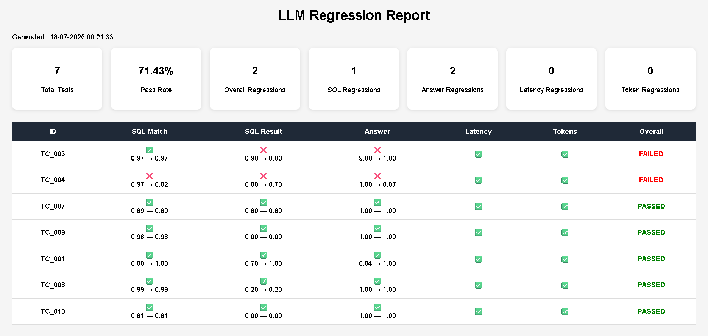

# Model Regression Detection System

A production-inspired framework for evaluating and monitoring LLM-powered applications by automatically detecting quality regressions before they reach end users.

The project demonstrates how AI applications can be continuously tested whenever prompts, models, or application logic change. Instead of relying on manual validation, the framework executes a benchmark suite against a golden dataset, compares the results with previous baseline runs, and identifies regressions in quality, latency, and overall behavior.

To demonstrate the evaluation framework, the project includes a **SQL Analytics Agent** that allows users to query a SQL Server database using natural language. The agent leverages Google's Gemini models, Retrieval-Augmented Generation (RAG), and SQL Server to convert business questions into executable SQL queries and return human-friendly answers.

---

# Why this project?

Large Language Models evolve rapidly. Small prompt modifications, model upgrades, or code changes can unintentionally reduce response quality.

Traditional software testing cannot validate LLM behavior effectively because outputs are probabilistic rather than deterministic.

This project addresses that challenge by providing an automated evaluation pipeline capable of:

* Running benchmark questions automatically
* Comparing outputs against a golden dataset
* Detecting behavioral regressions
* Measuring execution quality across multiple metrics
* Generating evaluation reports before deployment

This enables developers to identify quality degradations during development rather than after deployment.

---

# SQL Analytics Agent

The repository contains an end-to-end SQL Analytics Agent that serves as the benchmark application for regression testing.

The workflow consists of:

1. User asks a business question in natural language.
2. Relevant database schema is retrieved using a vector database (RAG).
3. Gemini generates an optimized SQL Server query.
4. The generated SQL is executed against SQL Server.
5. Query results are converted into a concise user-friendly response.
6. The complete execution is recorded for evaluation and regression analysis.

---

# Regression Detection Pipeline

The core objective of this project is to continuously evaluate LLM quality.

Whenever a prompt, model, or application logic changes, the pipeline:

* Loads benchmark questions from the golden dataset
* Executes every test case through the SQL Analytics Agent
* Collects generated SQL, execution results, answers, latency, and token usage
* Compares the latest run with previous baseline runs
* Detects regressions in response quality
* Generates evaluation reports
* Alerts developers before degraded outputs are shipped

This provides a CI/CD-style testing workflow specifically designed for LLM-powered applications.

---

# Key Features

* Natural language to SQL generation using Google Gemini
* SQL Server integration using pyodbc
* Retrieval-Augmented Generation (RAG) for intelligent schema selection
* FAISS vector database for semantic schema retrieval
* Golden dataset driven evaluation
* Automated regression detection
* Prompt and model comparison
* Execution latency tracking
* Token usage monitoring
* Modular architecture for future model integration
* Production-oriented project structure

---

# Technology Stack

| Component              | Technology                          |
| ---------------------- | ----------------------------------- |
| Programming Language   | Python 3.11                         |
| LLM                    | Google Gemini                       |
| Framework              | LangChain                           |
| Embeddings             | Gemini Embedding Model              |
| Vector Database        | FAISS                               |
| Database               | SQL Server                          |
| Database Connectivity  | pyodbc                              |
| Data Processing        | Pandas                              |
| Evaluation             | Custom Evaluation Engine            |
| CI/CD                  | GitHub Actions                      |

---

# Project Structure

```text
src/
│
├── config/
├── database/
├── llm/
├── evaluation/
├── regression/
├── reporting/
├── runner/
└── utils/
```

---

# Current Workflow

```
Natural Language Question
            │
            ▼
Schema Retrieval (RAG)
            │
            ▼
Gemini SQL Generation
            │
            ▼
SQL Validation
            │
            ▼
SQL Server Execution
            │
            ▼
Formatted Response
            │
            ▼
Evaluation Pipeline
```
---

# Regression Report:



---

# Planned Enhancements

* Automated benchmark execution using GitHub Actions
* Regression comparison across prompt versions
* LLM-as-a-Judge evaluation
* HTML regression dashboards
* Email notifications for failed benchmark runs
* Historical performance tracking
* Multi-model benchmarking
* Statistical regression analysis

